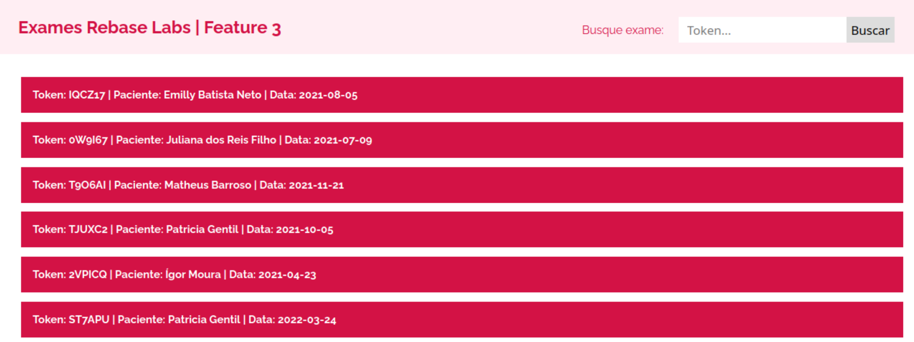

<h1 align="left">Rebase labs</h1>

Uma app web para listagem de exames médicos.

---

### Tech Stack


---


### Requisitos de sistema

* Docker

---

### Como rodar o projeto

Escolha um diretório no seu computador e execute o comando abaixo:

```
$ git clone git@github.com:Ricardonovais1/rebase_labs_challenge.git
```
```
$ cd rebase_labs_challenge
```

Rode todos os servidores - Cria uma rede e executa containers dentro dela:

```
$ docker compose up
```

Em outro terminal rode o comando abaixo para popular o banco de dados a partir do arquivo csv:

```
$ docker compose exec -it s2 bash
```
```
$ ruby import_from_csv.rb
```
---

### Como testar o projeto

Até o momento temos testes apenas das API's de testes e de exames.

(Considerando que todos os containers estejam sendo executados:)

```
$ docker compose exec -it s1 bash
```
```
$ bundle exec rspec
```
---
## *[Enunciado Feature 1] Importar os dados do CSV para um database SQL*

A primeira versão original da API deverá ter apenas um endpoint `/tests`, que lê os dados de um arquivo CSV e renderiza no formato JSON. Você deve _modificar_ este endpoint para que, ao invés de ler do CSV, faça a leitura **diretamente de uma base de dados SQL**.

#### Script para importar os dados

Este passo de "importar" os dados do CSV para um **database SQL** (por ex. PostgreSQL), pode ser feito com um script Ruby simples ou **rake** task, como preferir.


## **PREVIEW FEATURE 1:**

### Estrutura do banco de dados


Rotas para os endpoints do servidor 1:

#### * http://localhost:4001/tests --> Endpoint com todos os testes, reponse:

```
[{
            "id": "1",
            "cpf": "048.973.170-88",
            "nome paciente": "Emilly Batista Neto",
            "email paciente": "gerald.crona@ebert-quigley.com",
            "data nascimento paciente": "2001-03-11",
            "endereço/rua paciente": "165 Rua Rafaela",
            "cidade paciente": "Ituverava",
            "estado paciente": "Alagoas",
            "nome médico": "Maria Luiza Pires",
            "crm médico": "B000BJ20J4",
            "crm médico estado": "PI",
            "email médico": "denna@wisozk.biz",
            "token resultado exame": "IQCZ17",
            "data exame": "2021-08-05",
            "tipo exame": "hemácias",
            "limites tipo exame": "45-52",
            "resultado": "97"
}]
```
   #### * http://localhost:4001/exams --> Endpoint com todos os exames e seus respectivos testes, response:

```
[
   {
        "token resultado exame": "IQCZ17",
        "nome paciente": "Emilly Batista Neto",
        "data exame": "2021-08-05",
        "cpf": "048.973.170-88",
        "email paciente": "gerald.crona@ebert-quigley.com",
        "data nascimento paciente": "2001-03-11",
        "endereço/rua paciente": "165 Rua Rafaela",
        "cidade paciente": "Ituverava",
        "estado paciente": "Alagoas",
        "médico responsável": {
              "nome médico": "Maria Luiza Pires",
              "crm médico": "B000BJ20J4",
              "crm médico estado": "PI",
              "email médico": "denna@wisozk.biz"
        },
        "testes deste exame": [
              {
                    "tipo exame": "hemácias",
                    "limites tipo exame": "45-52",
                    "resultado": "97"
              },
              {
                    "tipo exame": "leucócitos",
                    "limites tipo exame": "9-61",
                    "resultado": "89"
              },
              {
                    "tipo exame": "plaquetas",
                    "limites tipo exame": "11-93",
                    "resultado": "97"
              },
              {
                    "tipo exame": "hdl",
                    "limites tipo exame": "19-75",
                    "resultado": "0"
              },
              {
                    "tipo exame": "ldl",
                    "limites tipo exame": "45-54",
                    "resultado": "80"
              },
              {
                    "tipo exame": "vldl",
                    "limites tipo exame": "48-72",
                    "resultado": "82"
              },
              {
                    "tipo exame": "glicemia",
                    "limites tipo exame": "25-83",
                    "resultado": "98"
              },
              {
                    "tipo exame": "tgo",
                    "limites tipo exame": "50-84",
                    "resultado": "87"
              },
              {
                    "tipo exame": "tgp",
                    "limites tipo exame": "38-63",
                    "resultado": "9"
              },
              {
                    "tipo exame": "eletrólitos",
                    "limites tipo exame": "2-68",
                    "resultado": "85"
              },
              {
                    "tipo exame": "tsh",
                    "limites tipo exame": "25-80",
                    "resultado": "65"
              },
              {
                    "tipo exame": "t4-livre",
                    "limites tipo exame": "34-60",
                    "resultado": "94"
              },
              {
                    "tipo exame": "ácido úrico",
                    "limites tipo exame": "15-61",
                    "resultado": "2"
              }
      ]
   }
]
```

---

### *[Enunciado Feature 2] Exibir listagem de exames no navegador Web*
Agora vamos exibir as mesmas informações da etapa anterior, mas desta vez de uma forma mais amigável ao usuário. Para isto, você deve criar uma nova aplicação, que conterá todo o código necessário para a web - HTML, CSS e Javascript.

Criar um endpoint do Sinatra (A) que devolve listagem de exames em formato JSON.

Adicionar também, outro endpoint do Sinatra (B) que devolve um HTML contendo apenas instruções Javascript. Estas instruções serão responsáveis por buscar os exames no enponint (A) e exibi-los na tela de forma amigável.

O objetivo aqui, neste passo, é carregar os dados de exames da API utilizando Javascript. Como exemplo, você pode abrir em seu browser o arquivo `index.html` contido neste snippet e investigar seu funcionamento.


## **PREVIEW FEATURE 2:**

#### Rota para acessar os exames no "frontend", configurado no servidor da aplicação 2:

####  http://localhost:4002/results --> Acessar todos os exames no cliente da aplicação.

#### Layout página de exames com as abas de detalhes fechadas:


#### Layout página de exames com a abas de detalhes aberta:


---


### [Enunciado Feature 3] Exibir detalhes de um exame em formato HTML a partir do token do resultado
Nesta etapa vamos implementar uma nova funcionalidade: pesquisar os resultados com base em um token de exame.

Você deve criar um endpoint no Sinatra (C) que devolve, com base no token enviado no request, os detalhes de um exame em formato JSON.

Adicionalmente, também criar, no HTML da listagem de exames, uma tag HTML `<form>` que via Javascript faz request ao endpoint (C) e renderiza os detalhes do exame em HTML.

#### Criar endpoint para mostrar os detalhes de um exame médico

Você deve implementar o endpoint `/tests/:token` que permita que o usuário da API, ao fornecer o token do exame, possa ver os detalhes daquele exame no formato JSON, tal como está implementado no endpoint
`/tests`. A consulta deve ser feita na base de dados.

## **PREVIEW FEATURE 3:**

#### Página com todos os exames (puxado do banco de dados), com input de pesquisa por token - http://localhost:4003/exams



#### Página de detalhes do exame - http://localhost:4003/exams/:token


---

### *[Enunciado Feature 4] Importar resultados de exames em formato CSV de forma assíncrona*
Neste momento fazemos o import através de um script. Mas este script tem que ser executado por alguém developer ou admin do sistema.
Para melhorar isto, idealmente qualquer usuário da API poderia chamar um endpoint para atualizar os dados. Assim, o endpoint deveria aceitar um arquivo CSV dinâmico e importar os dados para o PostgreSQL.
Exemplo:

$ POST /import

Implementar endpoint para receber um CSV no HTTP request
Neste passo, devemos focar apenas em receber o CSV via HTTP e utilizar o mesmo código do script de import para popular o database.

Executar o import do endpoint de forma assíncrona em background
Uma vez que fizemos o endpoint de POST /import, agora vamos focar numa implementação que permita que o usuário não fique à espera, ou seja, executar em um background job, mesmo o usuário sabendo que
não vai ficar pronto imediatamente. Neste caso, o processo de import fica pronto eventualmente.

Botão de "Importar CSV" na página Web em formato HTML
Neste momento, o processo de importar o CSV está manual com chamada direta ao endpoint POST /import. Para simplificar a quem utiliza a plataforma, a página HTML com a listagem pode trazer um botão que faz a requisição com o upload do conteúdo do arquivo CSV.

## **PREVIEW FEATURE 4:**

#### Página onde o usuário pode fazer o upload de um arquivo csv com dados dos exames - http://localhost:4004/upload


#### Após enviar arquivo aparece botão para ver a página com todos os exames - http://localhost:4002/results

